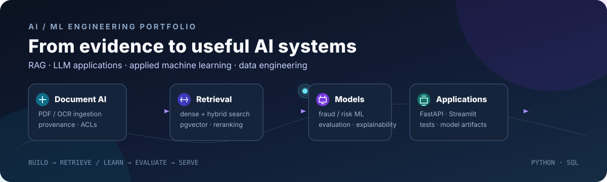
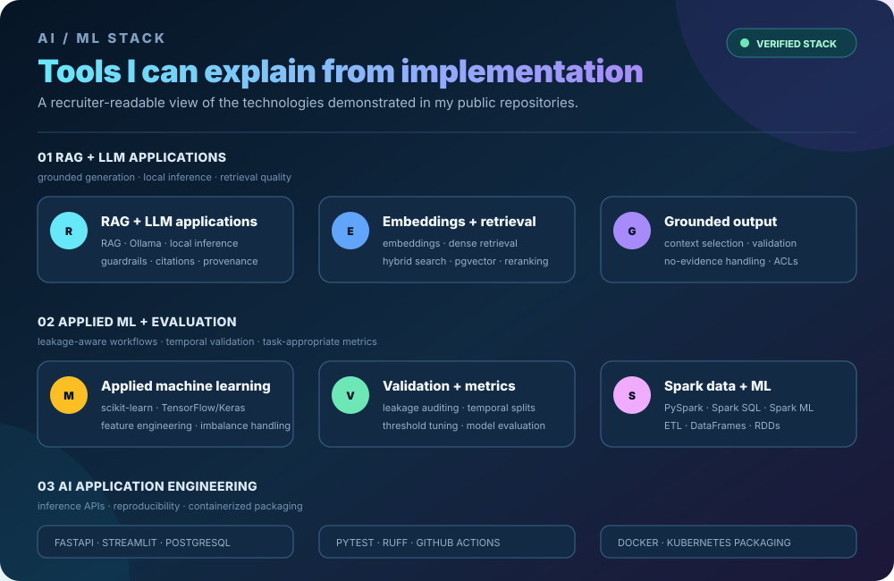
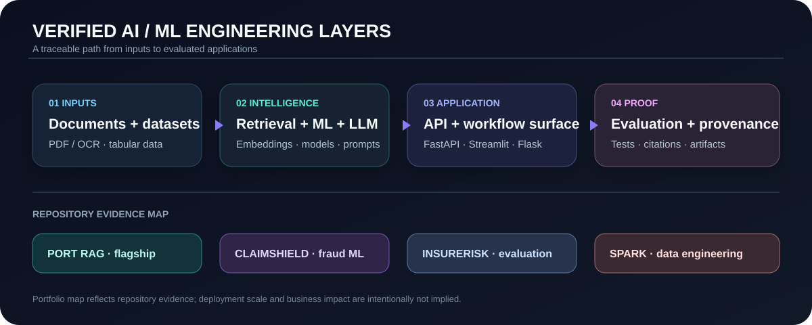
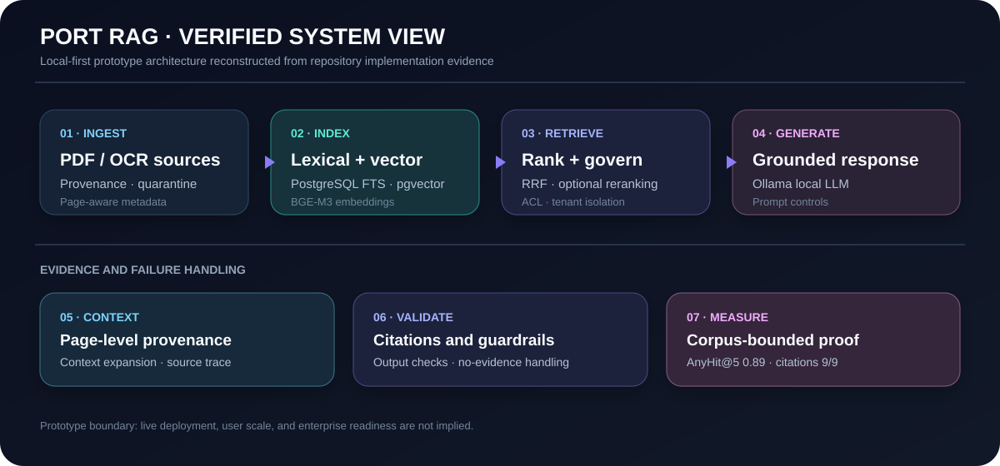

# DHANANJAY NERKAR

### AI/ML Engineer Candidate · RAG · LLM Applications · Applied Machine Learning

## About

I build evidence-grounded AI applications and evaluation-aware machine-learning systems with Python.

My public work shows a consistent path from documents and datasets to retrieval or model pipelines, usable application surfaces, and explicit evaluation or provenance checks.

| Focus | What the repositories demonstrate |
|---|---|
| **Grounded GenAI** | Local-first RAG, document ingestion, embeddings, hybrid search, reranking, citations, provenance, and access control |
| **Applied ML** | Leakage-aware preprocessing, imbalance handling, temporal validation, threshold tuning, explainability, and business-loss framing |
| **AI application engineering** | FastAPI, Flask, Streamlit, PostgreSQL-backed workflows, serialized artifacts, tests, and bounded CI |

> Portfolio boundary: production deployment, cloud ownership, user scale, and business impact are not claimed unless the linked repository provides evidence.

[GitHub](https://github.com/dhananjaynerkar) · [LinkedIn](https://www.linkedin.com/in/dhananjay-nerkar) · [Portfolio](https://portfolio-dhananjay-pi.vercel.app/) · [Resume](https://drive.google.com/file/d/1ECEzfyvgtdTXVBgBlhFwMT5JSecnWnET/view?usp=sharing)

---

## What I Build

<table>
<tr>
<td width="50%" valign="top"><strong>GROUNDED DOCUMENT AI</strong>  PDF/OCR ingestion, hybrid retrieval, citations, ACLs, and local generation.  <a href="https://github.com/dhananjaynerkar/ai_powered_port_management_system">Port Management RAG</a></td>
<td width="50%" valign="top"><strong>FRAUD AND RISK ML</strong>  Leakage-aware preprocessing, imbalance handling, temporal validation, threshold tuning, and business-loss analysis.  <a href="https://github.com/dhananjaynerkar/claimshield">ClaimShield</a> · <a href="https://github.com/dhananjaynerkar/insurerisk">Insurerisk</a></td>
</tr>
<tr>
<td width="50%" valign="top"><strong>DATA AND ML ENGINEERING</strong>  RDDs, DataFrames, Spark SQL, ETL, Spark ML, Docker, and Kubernetes packaging.  <a href="https://github.com/dhananjaynerkar/case_study_apache_spark">Spark education analytics</a></td>
<td width="50%" valign="top"><strong>NLP RETRIEVAL</strong>  Structured symptom matching, dense retrieval, multilingual normalization, and safety rules.  <a href="https://github.com/dhananjaynerkar/HealthBot">HealthBot</a></td>
</tr>
</table>

## Verified Technology Stack

| Area | Tools and methods |
|---|---|
| **Programming** | Python · SQL |
| **Machine Learning** | scikit-learn · TensorFlow/Keras · Spark ML · feature engineering · imbalanced learning · model evaluation |
| **GenAI and RAG** | Ollama · embeddings · PostgreSQL full-text search · pgvector · hybrid retrieval · reciprocal rank fusion · reranking · citations · provenance |
| **Applications and Data** | FastAPI · Flask · Streamlit · PostgreSQL · PySpark · Spark SQL |
| **Quality and Reproducibility** | pytest · Ruff · model/artifact serialization · configuration-driven pipelines · GitHub Actions · Docker · Kubernetes packaging |

## Visual Engineering Pipeline

The map is a capability view of the repositories below; it does not imply that every project contains every layer or that any system is a production service.

## Engineering Toolchain

`Python` → `documents / tabular data` → `retrieval / ML / local LLM` → `FastAPI / Flask / Streamlit` → `PostgreSQL / pgvector` → `tests / artifacts / evaluation` → `Docker / Kubernetes packaging`

This is a verified capability path across the portfolio, not a claim that one repository implements every step.

## Flagship System

<table>
<tr>
<td width="33%" valign="top"><strong>PROBLEM SURFACE</strong>  Port-management documents and governed workflows</td>
<td width="34%" valign="top"><strong>AI PIPELINE</strong>  PDF/OCR → full-text + vector retrieval → rank fusion and reranking → local LLM → citations and ACLs</td>
<td width="33%" valign="top"><strong>PROOF</strong>  AnyHit@5 0.89 · EvidenceCoverage@5 0.85 · 10/10 facts · 9/9 citation-valid replays</td>
</tr>
</table>

### [AI-Powered Port Management System](https://github.com/dhananjaynerkar/ai_powered_port_management_system)

**Local-first prototype · RAG and workflow platform · production deployment not verified**

Python, FastAPI, PostgreSQL, pgvector, Ollama, and BGE-M3.

- PDF/OCR ingestion with page-level provenance and quarantine states.
- Lexical plus dense retrieval with rank fusion, reranking, ACL filtering, and citation validation.
- Corpus-bound checkpoint: AnyHit@5 **0.89**, EvidenceCoverage@5 **0.85**, **10/10** mapped facts covered, and **9/9** citation-valid replays.
- Includes architecture, security, evaluation, workflow, operations, and bounded CI documentation.

## Selected Projects

<table>
<tr>
<td width="50%" valign="top"><strong><a href="https://github.com/dhananjaynerkar/claimshield">CLAIMSHIELD</a></strong>  <strong>ML · FRAUD DECISION SUPPORT</strong>  TensorFlow/Keras workflow with leakage-aware preprocessing, training-only imbalance handling, threshold selection, and reloadable artifacts.  ROC-AUC 0.8161 · PR-AUC 0.1829 · recall 0.8811 at threshold 0.30  Dataset redistribution rights require confirmation.</td>
<td width="50%" valign="top"><strong><a href="https://github.com/dhananjaynerkar/insurerisk">INSURERISK</a></strong>  <strong>ML · EVALUATION ENGINEERING</strong>  Time-aware tabular pipeline with leakage auditing, temporal features, imbalance handling, threshold tuning, business-loss analysis, artifacts, and Streamlit scoring.  Test-window checkpoint is weak; no production success or business impact is claimed.</td>
</tr>
<tr>
<td width="50%" valign="top"><strong><a href="https://github.com/dhananjaynerkar/case_study_apache_spark">SMART EDUCATION ANALYTICS</a></strong>  <strong>DATA · SPARK ML</strong>  OULAD case study covering RDDs, DataFrames, Spark SQL, ETL, Spark ML, Docker, Kubernetes manifests, and GitHub Actions checks.  Holdout AUC 0.9706 · accuracy 0.9142 · F1 0.9142 for the documented outcome proxy.</td>
<td width="50%" valign="top"><strong><a href="https://github.com/dhananjaynerkar/HealthBot">HEALTHBOT</a></strong>  <strong>NLP · DENSE RETRIEVAL</strong>  Educational local NLP demo with structured symptom matching, multilingual normalization, dense similarity, and safety rules.  Not a clinical system and not presented as document RAG.</td>
</tr>
</table>

## Evidence-Based Capability Matrix

| Capability | Evidence level | Repository proof |
|---|---|---|
| **Grounded RAG and local LLM applications** | **PRIMARY** | [Port RAG](https://github.com/dhananjaynerkar/ai_powered_port_management_system) — retrieval, local generation, citation validation, ACLs |
| **Applied ML and evaluation design** | **PRIMARY** | [ClaimShield](https://github.com/dhananjaynerkar/claimshield) · [Insurerisk](https://github.com/dhananjaynerkar/insurerisk) — leakage controls, validation, thresholding, task metrics |
| **AI application engineering** | **DEMONSTRATED** | Port RAG, [HealthBot](https://github.com/dhananjaynerkar/HealthBot), and Insurerisk — APIs, local apps, readiness, artifacts, tests |
| **Data engineering and distributed ML** | **DEMONSTRATED** | [Spark case study](https://github.com/dhananjaynerkar/case_study_apache_spark) — Spark ETL, Spark ML, Docker/Kubernetes packaging, CI |

## Engineering Practices

- Separate implementation evidence from deployment and production-readiness claims.
- Treat datasets, credentials, evaluation splits, and generated artifacts as explicit boundaries.
- Prefer reproducible configuration, model contracts, provenance notes, and failure handling.
- Use tests and CI to verify portable behavior while documenting excluded live-database or fixture-dependent checks.

## Proof of Engineering

| Capability | Repository proof |
|---|---|
| **RAG / LLM** | [Port RAG](https://github.com/dhananjaynerkar/ai_powered_port_management_system) → retrieval, citation, ACL, and runtime evaluation |
| **Fraud ML** | [ClaimShield](https://github.com/dhananjaynerkar/claimshield) → thresholded deep-learning inference and test metrics |
| **Evaluation-aware ML** | [Insurerisk](https://github.com/dhananjaynerkar/insurerisk) → temporal validation, leakage notes, and business-loss framing |
| **Data engineering** | [Spark case study](https://github.com/dhananjaynerkar/case_study_apache_spark) → Spark ETL, Spark ML, Docker, Kubernetes packaging, and CI |

## Current Focus

Strengthening clean-checkout reproducibility, corpus-versioned evaluation, citation and grounding checks, and clearly bounded local deployment for existing AI/ML systems.

No separate “Building Now” project is listed because a current project stage was not independently verified.

## Activity

GitHub activity is visible in the native contribution graph on this profile. It is supporting context, not a claim about production impact, users, or scale.

## Connect

- Email: nerkarr.dhananjay@gmail.com
- LinkedIn: https://www.linkedin.com/in/dhananjay-nerkar
- Portfolio: https://portfolio-dhananjay-pi.vercel.app/
- GitHub Pages: https://dhananjaynerkar.github.io/
- GitHub: https://github.com/dhananjaynerkar

